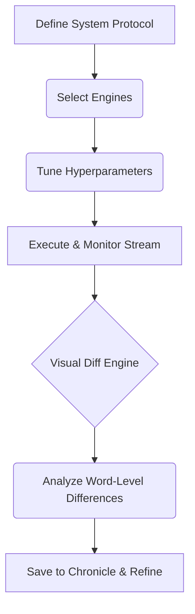

# Processing Benchmark Suite

[](https://nextjs.org/)
[](https://reactjs.org/)
[](https://tailwindcss.com/)

A web application for comparing algorithm outputs and metrics.

## Workflow Architecture



## Directory Structure

```text
/
├── app/               # Next.js App Router & Server Components
├── components/        # Metrics display, Diff views, Editor UI
├── lib/               # Diffing engine, SDK integration, Benchmarking logic
├── public/            # Static Assets & Screenshots
└── package.json       # Dependencies & Scripts
```

## Metrics Collection

Captures TTFT (Time To First Token) latency during execution. 
Uses the `diff` algorithm to display word-level differences between outputs.

## Features

*   **Diffing**: Compare text outputs side-by-side.
*   **Scroll Synchronization**: Scroll multiple columns simultaneously.
*   **Configuration**: Adjust Temperature, Top-P, and Max Tokens per column.
*   **Session Storage**: Saves history to `localStorage`.

## Tech Stack

| Layer | Technology |
| :--- | :--- |
| **Framework** | Next.js 16 |
| **State** | React 19 |
| **Styling** | Tailwind CSS 4 |

## Getting Started

```bash
git clone https://github.com/GaneshArwan/MultiModelAI.git
cd MultiModelAI
npm install
npm run dev
```

## Deployment

Requires client-side API keys. Keys are stored locally in the browser and passed directly to the provider endpoints.

## License

MIT License © 2026 GaneshArwan
